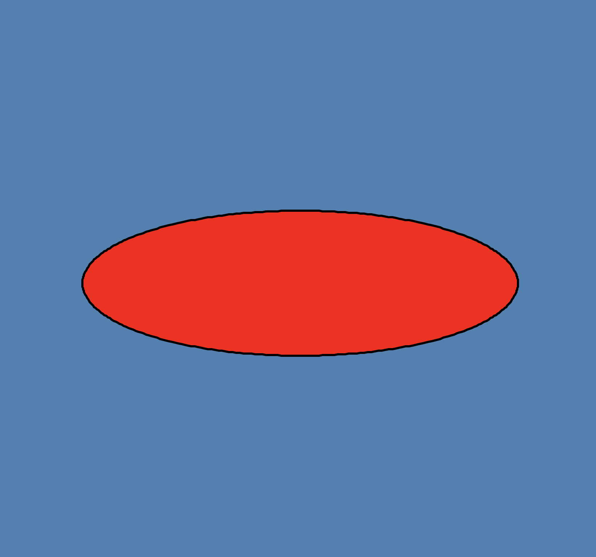

### project structure
```
calculus_vector_analysis/
│── node_modules/
│── src/
│   ├── basic_linear_algebra/
│   │   ├── tensor/
│   │   │   ├── tensor_operations.js
│   │   ├── maxtix/
│   │   │   ├── matrix_operations.js
│   │   ├── vector/
│   │   │   ├── vector_operations.js
│   ├── calculus/
│   │   ├── integration/
│   │   │   ├── substitution/
│   │   │   │   ├── substitution.py
│   │   │   │   └── README.md
│   │   │   ├── by_parts/
│   │   │   │   ├── integration_by_parts.py
│   │   │   │   └── README.md
│   │   │   ├── natural_log/
│   │   │   │   ├── natural_log.py
│   │   │   │   └── README.md
│   │   │   └── fundamental_theorem/
│   │   │       ├── fundamental_theorem.py
│   │   │       └── README.md
│   ├── vectors/
│   │   ├── dot_product.js
│   │   ├── cross_product.js
│   └── turtle/
│── tests/
│   ├── basic_linear_algebra.test.js
│   ├── calculus.test.js
│── package.json
│── .gitignore
```

### quick links
#### 울프람알파 / 그래프
- https://www.wolframalpha.com/examples/mathematics/plotting-and-graphics
- https://www.wolframalpha.com/input?i=x%5E3+-+6x%5E2+%2B+4x+%2B+12%EC%9D%98+%ED%94%8C%EB%A1%AF&lang=ko
- https://www.wolframalpha.com/input?i=%28cos+t%2C+sin+2t%2C+sin+3t%29%EC%9D%98+%EC%82%BC%EC%B0%A8%EC%9B%90+%EB%A7%A4%EA%B0%9C+%EB%B3%80%EC%88%98+%ED%94%8C%EB%A1%AF&lang=ko

### ellipse (타원)


- 세타 호도법 변환 공식
`
t = i*(pi/180)
`
- 타원 매개변수 방정식
`
x = a*cos(t)
y = b*sin(t)
`
